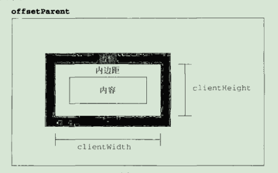
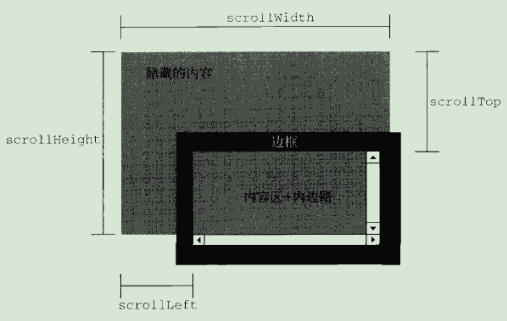

#### 元素大小
1. 偏移量：元素在屏幕上占用的**可见空间**(由高度、宽度决定，包括内边距、滚动条、边框)
   + offsetWidth: 元素在水平方向占用的空间大小，以像素计，包括宽度、可见的垂直滚动条的宽度、左右边框的宽度
   + offsetHeight: 元素在垂直方向占用的空间大小，以像素计，包括高度、可见的水平滚动条的高度、上下边框的高度
   + offsetParent: 包含元素，最近的祖先定位元素
   + offsetLeft: 元素的左外边框至包含元素的左内边框的像素距离
   + offsetTop: 元素的上外边框至包含元素的上内边框的像素距离

     
   + 注意:
     - 所有偏移量属性都是只读的
     - 每次访问偏移量属性都需要重新计算, 应尽量避免重复访问
     - 如果给元素设置了display:none，则它的偏移量属性都为0
2. 客户区大小：指的是元素内容及其内边距所占据的空间大小
   + clientWidth: 元素内容区宽度加上左右内边距宽度(不计算滚动条占用的空间)
   + clientHeight: 元素内容区高度加上上下内边距宽度(不计算滚动条占用的空间)

     
   + 常用于确定浏览器视口的大小
     ```
     function getViewport() {
         if (document.compatMode === 'BackCompat') {
             return {
                 width: document.body.clientWidth,
                 height: document.body.clientHeight
             }
         } else {
             return {
                 width: document.documentElement.clientWidth,
                 height: document.documentElement.clientHeight
             }
         }

     }
     ```
     + 客户区大小也是只读的，每次访问也要重新计算
3. 滚动大小：指的是包含滚动内容的元素的**实际大小**
   + scrollWidth: 在没有滚动条的情况下，元素内容的总宽度
   + scrollHeight: 在没有滚动条的情况下，元素内容的总高度
   + scrollLeft: 被隐藏在内容区域左侧的像素数，通过这个属性可以改变元素的滚动位置
   + scrollTop: 被隐藏在内容区域上方的像素数，通过这个属性可以改变元素的滚动位置

     
   + 对于不包含滚动条的页面而言，scrollWidth和scrollHeight与clientWidth和clientHeight之间的关系并不清晰
     ```
     //确定文档的总高度时，必须取scrollWidth/clientWidth和scrollHeight/和clientHeight中的最大值
     function getDoc() {
         if (document.compatMode === 'BackCompat') {
             return {
                 width: Math.max(document.body.clientWidth, document.body.scrollWidth),
                 height: Math.max(document.body.clientHeight, document.body.scrollHeight)
             }
         } else {
             return {
                 width: Math.max(document.documentElement.clientWidth, document.documentElement.scrollWidth),
                 height: Math.max(document.documentElement.clientHeight, document.documentElement.scrollHeight)
             }
         }

     }
     ```
4. 确定元素大小
   + 元素的getBoundingClientRect()方法返回一个矩形对象
