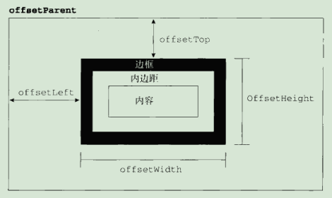

#### 访问元素的样式
1. style特性
   + style属性，是CSSStyleDeclaration的实例，包含着通过HTML的**style特性**指定的所有样式信息，
     但不包含与外部样式表或嵌入样式表经层叠而来的样式
   + 减号改为驼峰，float是js中的保留字，用cssFloat或styleFloat(ie)访问

2. 计算的样式
   + document.defaultView的getComputedStyle()方法，返回一个CSSStyleDeclaration的对象，
     包含当前元素的所有计算的样式
   + getComputedStyle()方法，第一个参数是元素，第二个参数是null或一个伪元素字符串(':after')
   + IE不支持getComputedStyle()方法，但每个具有style属性的元素还有一个currentStyle属性，包含计算后的样式
   + 无论哪个浏览器，所有计算的样式都是只读的
   ```
   <!DOCTYPE html>
   <html lang="en">
       <head>
           <meta charset="UTF-8">
           <title>Title</title>
           <style>
               #myDiv::after {content: ""; display: block; width: 0; height: 0; clear: both; visibility: hidden;}
               #myDiv .btn {float: left; padding: 5px 10px; border: 1px solid #ccc;}
           </style>
       </head>
   <body>
       <div id="myDiv">
           <div class="btn" style="background-color: pink;">
               按钮
           </div>
       </div>
       <script>
           var btn = document.querySelector('#myDiv .btn');
           console.log('background-color: ', btn.style.backgroundColor);//background-color:  pink
           console.log('border: ', btn.style.border);//border:
           console.log('getPropertyValue("background-color"): ', btn.style.getPropertyValue('background-color'));//getPropertyValue("background-color"):  pink
           console.log('getPropertyValue("border"): ', btn.style.getPropertyValue('border'));//getPropertyValue("border"):
           console.log('getPropertyPriority("background-color"): ', btn.style.getPropertyPriority('background-color'));//getPropertyPriority("background-color"):
           console.log('item(index): ', btn.style.item(0), btn.style[0]);//item(index):  background-color background-color
           console.log('cssText: ', btn.style.cssText);//cssText:  background-color: pink;
           console.log('length: ', btn.style.length);//length:  1
           console.log('parentRule: ', btn.style.parentRule);//parentRule:  null
           btn.style.removeProperty('background-color');//
           btn.style.setProperty('background-color', 'yellowGreen');//
           console.log('');
           var computedStyle = btn.currentStyle || document.defaultView.getComputedStyle(btn, null);
           console.log('background-color: ', computedStyle.backgroundColor);//background-color:  rgb(154, 205, 50)
           console.log('border: ', computedStyle.border);//border:  1.25px solid rgb(204, 204, 204)
           console.log('getPropertyValue("background-color"): ', computedStyle.getPropertyValue('background-color'));//getPropertyValue("background-color"):  rgb(154, 205, 50)
           console.log('getPropertyValue("border"): ', computedStyle.getPropertyValue('border'));//getPropertyValue("border"):  1.25px solid rgb(204, 204, 204)
           console.log('getPropertyPriority("background-color"): ', computedStyle.getPropertyPriority('background-color'));//getPropertyPriority("background-color"):
           console.log('cssText: ', computedStyle.cssText);//很多
           console.log('length: ', computedStyle.length);//length:  282
           console.log('item(index): ', computedStyle.item(0), computedStyle[0]);//item(index):  animation-delay animation-delay
           console.log('parentRule: ', computedStyle.parentRule);//parentRule:  null
       </script>
   </body>
   </html>
   ```

#### 元素大小
1. 偏移量
   + offsetWidth: 元素在水平方向占用的空间大小，以像素计，包括宽度、可见的垂直滚动条的宽度、左右边框的宽度
   + offsetHeight: 元素在垂直方向占用的空间大小，以像素计，包括高度、可见的水平滚动条的高度、上下边框的高度
   + offsetParent: 包含元素，最近的祖先定位元素
   + offsetLeft: 元素的左外边框至包含元素的左内边框的像素距离
   + offsetTop: 元素的上外边框至包含元素的上内边框的像素距离

     
   + 注意:
     - 所有偏移量属性都是只读的
     - 如果给元素设置了display:none，则它的偏移量属性都为0
     - 每次访问偏移量属性都需要重新计算
2. 客户区大小
3. 滚动大小
4. 确定元素大小

